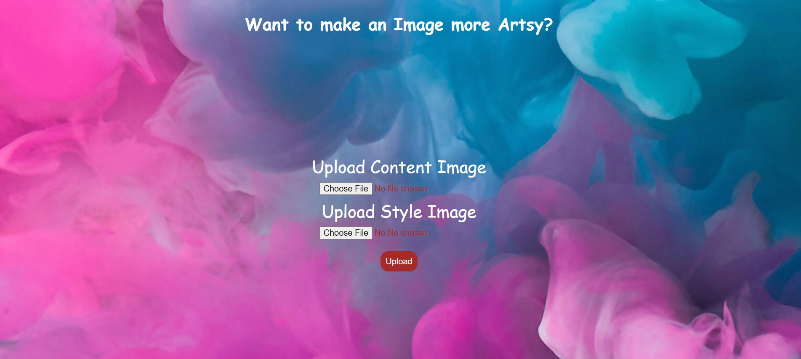
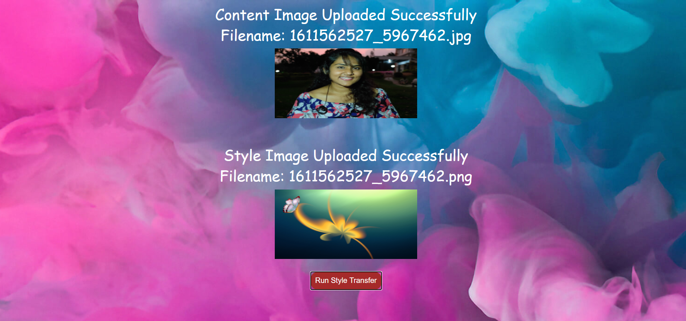
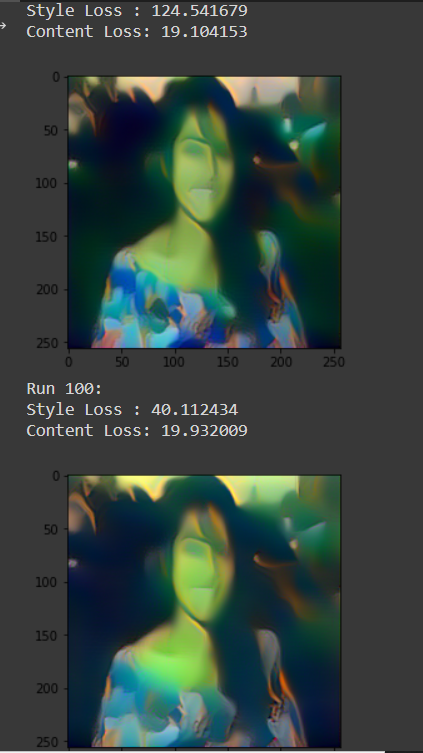
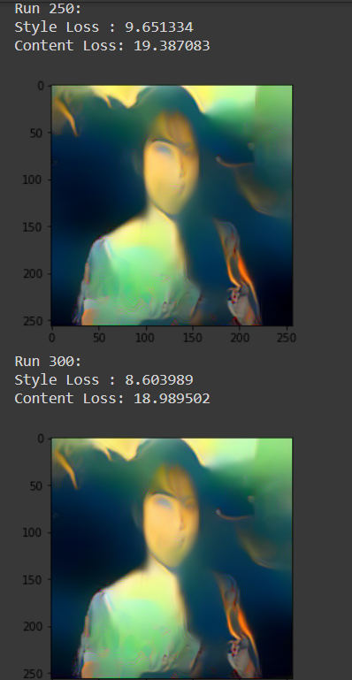

# Making-Images-Artsy-Neural-Style-Transfer
The whole idea of editing images and making them more creative by merging with them other images lies in the principle of Neural Style Transfer. Neural style transfer is an optimization technique used to take three images, a content image, a style reference image (such as an artwork by a famous painter), and the input image you want to style — and blend them together such that the input image is transformed to look like the content image, but “painted” in the style of the style image.
The principle is simple: we define two distances, one for the content (DC) and one for the style (DS). DC measures how different the content is between two images while DS measures how different the style is between two images. Then, we take a third image, the input, and transform it to minimize both its content-distance with the content-image and its style-distance with the style-image. Now we can import the necessary packages and begin the neural transfer.

I have taken the help of Pytorch Neural Style Transfer: https://pytorch.org/tutorials/advanced/neural_style_tutorial.html and idea from the paper https://arxiv.org/abs/1508.06576
I have also incorporated a Flask Application deployed on Heroku Cloud.

 | 

